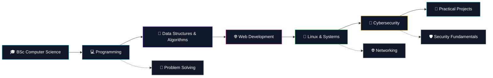

<div align="center">


<br>


<br><br>

```text
╭──────────────────────────────────────────────────────────────────────╮
│                                                                      │
│   $ whoami                                                           │
│   budheswarsoren                                                     │
│                                                                      │
│   $ echo "Developer journey initialized..."                          │
│                                                                      │
│   [████████████████████████████████████████████████] 100%            │
│                                                                      │
│   ✓ profile loaded                                                   │
│   ✓ development environment ready                                    │
│   ✓ learning mode active                                             │
│   ✓ curiosity detected                                               │
│                                                                      │
╰──────────────────────────────────────────────────────────────────────╯
```

</div>

---

## `$ cat about.txt`

<table>
<tr>
<td width="67%" valign="top">

### 👋 About Me

I'm a **BSc Computer Science student** at **Dhenkanal Autonomous College**, currently in my **2nd year**.

I'm interested in **software development, programming, technology and cybersecurity**. I enjoy learning through experimentation, understanding how systems work, and gradually turning what I learn into practical skills.

Right now, I'm focused on strengthening my fundamentals and building my path toward becoming a better developer.

```python
while learning:
    explore()
    experiment()
    understand()
    improve()
```

</td>

<td width="33%" valign="top">

```text
┌─────────────────────────────┐
│       USER PROFILE          │
├─────────────────────────────┤
│                             │
│ NAME      : Budheswar       │
│ ROLE      : Student         │
│ DOMAIN    : Development     │
│ INTEREST  : Cybersecurity   │
│ OS        : Linux Explorer  │
│ MODE      : Learning        │
│ STATUS    : ● ONLINE        │
│                             │
└─────────────────────────────┘
```

</td>
</tr>
</table>

---

## `$ cat education.txt`

<div align="center">

<table>
<tr>
<td width="50%" align="center">

### 🎓 B.Sc. Computer Science

**Dhenkanal Autonomous College**

`2nd Year`

</td>

<td width="50%" align="center">

### 🧭 Current Direction

`Programming`

`Data Structures`

`Web Development`

`Cybersecurity`

</td>
</tr>
</table>

</div>

---

## `$ ./learning.sh`

<table>
<tr>
<td width="50%" valign="top">

### 💻 Programming

```text
C
C++
Python

Data Structures
Algorithms
Problem Solving
Programming Fundamentals
```

</td>

<td width="50%" valign="top">

### 🌐 Development

```text
HTML
CSS
JavaScript

Git
GitHub
Development Fundamentals
```

</td>
</tr>

<tr>
<td valign="top">

### 🔐 Cybersecurity

```text
Linux Fundamentals
Networking Concepts
Web Security
Security Fundamentals
Ethical Hacking Concepts
```

</td>

<td valign="top">

### 🧠 Exploring

```text
Open Source
Developer Tools
Systems
New Technologies
Practical Learning
```

</td>
</tr>
</table>

---

## `$ ls tech-stack/`

<div align="center">

### `// languages`


<br><br>

### `// web`


<br><br>

### `// environment`


</div>

---

## `$ ./system-map.sh`



---

## `$ cat roadmap.md`

<div align="center">

```text
╔══════════════════════════════════════════════════════════════╗
║                    DEVELOPMENT ROADMAP                      ║
╠══════════════════════════════════════════════════════════════╣
║                                                              ║
║  [✓] Programming Fundamentals                               ║
║       │                                                      ║
║       ├──► [✓] C / C++ / Python                              ║
║       │                                                      ║
║       ├──► [~] Data Structures & Algorithms                  ║
║       │                                                      ║
║       ├──► [~] Web Development                               ║
║       │                                                      ║
║       ├──► [~] Linux & Systems                               ║
║       │                                                      ║
║       ├──► [~] Cybersecurity Fundamentals                    ║
║       │                                                      ║
║       └──► [ ] Build Real Projects                           ║
║                                                              ║
║                    [ NEXT LEVEL ]                            ║
║                                                              ║
╚══════════════════════════════════════════════════════════════╝
```

`[✓] Familiar` `[~] Learning` `[ ] Future`

</div>

---

## `$ systemctl status development`

<div align="center">

```text
● development.service - Personal Growth

   Loaded:     enabled
   Active:     active (learning)

   Programming        [██████████████████░░] 90%
   Problem Solving    [███████████████░░░░░] 75%
   Data Structures    [██████████████░░░░░░] 70%
   Web Development    [████████████░░░░░░░░] 60%
   Linux              [███████████░░░░░░░░░] 55%
   Cybersecurity      [██████████░░░░░░░░░░] 50%

   Status: continuously improving...
```

</div>

---

## `$ ./workflow.sh`

<div align="center">

```text
┌────────────┐
│    IDEA    │
└─────┬──────┘
      ▼
┌────────────┐
│   LEARN    │
└─────┬──────┘
      ▼
┌────────────┐
│ EXPERIMENT │
└─────┬──────┘
      ▼
┌────────────┐
│   BUILD    │
└─────┬──────┘
      ▼
┌────────────┐
│   DEBUG    │
└─────┬──────┘
      ▼
┌────────────┐
│ UNDERSTAND │
└─────┬──────┘
      ▼
┌────────────┐
│  IMPROVE   │
└─────┬──────┘
      ▼
┌────────────┐
│   REPEAT   │
└────────────┘
```

</div>

---

## `$ ls interests/`

<div align="center">

<table>
<tr>

<td align="center" width="20%">

### ⚽

**FOOTBALL**

</td>

<td align="center" width="20%">

### 🎮

**GAMING**

</td>

<td align="center" width="20%">

### 🌍

**EXPLORING**

</td>

<td align="center" width="20%">

### 💻

**TECHNOLOGY**

</td>

<td align="center" width="20%">

### 🔐

**CYBERSECURITY**

</td>

</tr>
</table>

<br>

`Football` • `Gaming` • `Exploring` • `Technology` • `Learning`

</div>

---

## `$ cat personality.conf`

<table>
<tr>
<td width="50%" valign="top">

```ini
[INTERESTS]

football = true
gaming = true
exploring = true
technology = true
learning = true
cybersecurity = true
```

</td>

<td width="50%" valign="top">

```ini
[WORKFLOW]

curiosity = high
experimentation = active
problem_solving = developing
consistency = improving
creativity = active
```

</td>
</tr>
</table>

---

## `$ git status`

<div align="center">

```text
On branch main

Your learning journey is currently evolving.

Changes not staged:
  modified: programming
  modified: problem-solving
  modified: web-development
  modified: cybersecurity

Untracked:
  future-projects/

nothing is finished.
everything is a work in progress.
```

</div>

---

## `$ git stats`

<div align="center">


<br><br>


<br><br>


</div>

---

## `$ activity --graph`

<div align="center">


</div>

---

## `$ ./contributions.sh`

<div align="center">

<picture>
  <source media="(prefers-color-scheme: dark)" srcset="https://raw.githubusercontent.com/budheswarsoren/budheswarsoren/output/github-contribution-grid-snake-dark.svg">
  <source media="(prefers-color-scheme: light)" srcset="https://raw.githubusercontent.com/budheswarsoren/budheswarsoren/output/github-contribution-grid-snake.svg">
  
</picture>

</div>

---

## `$ cat philosophy.txt`

<div align="center">

```text
╭──────────────────────────────────────────────────────────────╮
│                                                              │
│  "Understand the technology, don't just use it."             │
│                                                              │
│  Learn → Experiment → Build → Break → Understand → Improve   │
│                                                              │
╰──────────────────────────────────────────────────────────────╯
```

</div>

---

## `$ ./connect.sh`

<div align="center">

```text
┌──────────────────────────────────────────────────────┐
│                                                      │
│   NETWORK INTERFACE                                  │
│                                                      │
│   [01] LinkedIn    → professional                   │
│   [02] Instagram  → personal                        │
│                                                      │
│   connection_status: available                      │
│                                                      │
└──────────────────────────────────────────────────────┘
```

<br>

<a href="https://www.linkedin.com/in/budheswar-soren-8874a235/">

</a>

  

<a href="https://www.instagram.com/_dingra_kuna_/">

</a>

</div>

---

## `$ ./profile_status.sh`

<div align="center">

```text
╭──────────────────────────────────────────────────────────────╮
│                                                              │
│   PROFILE STATUS                                             │
│   ───────────────────────────────────────────────────────    │
│                                                              │
│   Education            : BSc Computer Science                │
│   College              : Dhenkanal Autonomous College        │
│   Year                 : 2nd Year                            │
│   Development          : ACTIVE                              │
│   Linux                : EXPLORING                           │
│   Cybersecurity        : EXPLORING                           │
│   Projects             : FUTURE                              │
│   Learning             : ALWAYS ON                           │
│                                                              │
╰──────────────────────────────────────────────────────────────╯
```

<br>


</div>

---

<div align="center">

```text
$ echo "Thanks for visiting my profile."

██████╗  ██╗   ██╗██╗██╗     ██████╗ 
██╔══██╗ ██║   ██║██║██║     ██╔══██╗
██████╔╝ ██║   ██║██║██║     ██║  ██║
██╔══██╗ ██║   ██║██║██║     ██║  ██║
██████╔╝ ╚██████╔╝██║███████╗██████╔╝
╚═════╝   ╚═════╝ ╚═╝╚══════╝╚═════╝

CODE • LEARN • EXPLORE • GROW 🚀
```

</div>
