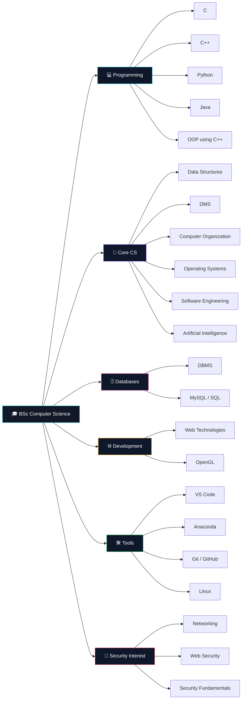

<div align="center">


<br>


<br><br>

```text
╭──────────────────────────────────────────────────────────────────────╮
│                                                                      │
│   $ whoami                                                           │
│   budheswarsoren                                                     │
│                                                                      │
│   $ echo "Developer journey initialized..."                         │
│                                                                      │
│   [████████████████████████████████████████████████] 100%            │
│                                                                      │
│   ✓ profile loaded                                                   │
│   ✓ development environment ready                                    │
│   ✓ learning mode active                                             │
│                                                                      │
╰──────────────────────────────────────────────────────────────────────╯
```

</div>

---

## `$ cat about.txt`

<table>
<tr>
<td width="67%" valign="top">

### 👋 About Me

I'm a **BSc Computer Science student** at **Dhenkanal Autonomous College**, currently in my **2nd year**.

I'm interested in **software development, programming, databases, computer systems, technology and cybersecurity**.

I'm currently building my foundation across programming, core computer science subjects and development tools while exploring areas that interest me beyond the classroom.

```python
while learning:
    explore()
    experiment()
    understand()
    improve()
```

</td>

<td width="33%" valign="top">

```text
┌─────────────────────────────┐
│       USER PROFILE          │
├─────────────────────────────┤
│                             │
│ NAME      : Budheswar       │
│ ROLE      : CS Student      │
│ DOMAIN    : Development     │
│ CODE      : C/C++/Python    │
│ DATABASE  : MySQL / DBMS    │
│ TOOLS     : VS Code / Git   │
│ OS        : Linux Explorer  │
│ MODE      : Learning        │
│ STATUS    : ● ONLINE        │
│                             │
└─────────────────────────────┘
```

</td>
</tr>
</table>

---

## `$ cat education.txt`

<div align="center">

<table>
<tr>
<td width="50%" align="center">

### 🎓 B.Sc. Computer Science

**Dhenkanal Autonomous College**

`2nd Year`

</td>

<td width="50%" align="center">

### 📚 Academic Focus

`Programming`

`Data Structures`

`Computer Systems`

`Databases`

`Web Technologies`

</td>
</tr>
</table>

</div>

---

## `$ ./learning.sh`

<table>
<tr>
<td width="50%" valign="top">

### 💻 Programming

```text
C
C++
Python
Java

OOP using C++
Data Structures
Problem Solving
Programming Fundamentals
```

</td>

<td width="50%" valign="top">

### 🗄️ Databases

```text
DBMS
MySQL
SQL
Database Fundamentals
Data Management
```

</td>
</tr>

<tr>
<td valign="top">

### 🧠 Core Computer Science

```text
DMS
Computer Organization
Operating Systems
Software Engineering
Artificial Intelligence
```

</td>

<td valign="top">

### 🌐 Development & Graphics

```text
Web Technologies
OpenGL
Web Fundamentals
Graphics Concepts
Development Workflow
```

</td>
</tr>

<tr>
<td valign="top">

### 🛠️ Tools & Environment

```text
VS Code
Anaconda
Git
GitHub
Linux
Terminal
```

</td>

<td valign="top">

### 🔐 Technical Interests

```text
Cybersecurity
Linux
Networking
Web Security
Systems
Technology
```

</td>
</tr>
</table>

---

## `$ ls tech-stack/`

<div align="center">

### `// programming`


<br><br>

### `// database`


<br><br>

### `// tools`


<br><br>

### `// development areas`

`Data Structures`   `DBMS`   `OOP`   `Web Technologies`   `OpenGL`

</div>

---

## `$ ./stack_overview.sh`

<div align="center">

<table>
<tr>
<td align="center" width="25%">

### `PROGRAMMING`

💻 C
⚙️ C++
🐍 Python
☕ Java
🧩 OOP

</td>

<td align="center" width="25%">

### `CORE CS`

🧩 Data Structures
🗄️ DBMS
🖥️ OS
⚙️ Computer Organization
📐 DMS

</td>

<td align="center" width="25%">

### `DEVELOPMENT`

🌐 Web Technologies
🎨 OpenGL
🤖 AI
🛠️ Software Engineering

</td>

<td align="center" width="25%">

### `TOOLS`

💙 VS Code
🧪 Anaconda
🐧 Linux
🔧 Git
🐙 GitHub

</td>
</tr>
</table>

</div>

---

## `$ ./system-map.sh`



---

## `$ cat roadmap.md`

<div align="center">

```text
╔══════════════════════════════════════════════════════════════════╗
║                        LEARNING ROADMAP                         ║
╠══════════════════════════════════════════════════════════════════╣
║                                                                  ║
║  PROGRAMMING                                                     ║
║      │                                                           ║
║      ├── C                                                       ║
║      ├── C++                                                     ║
║      ├── Python                                                   ║
║      └── Java                                                     ║
║                                                                  ║
║  CORE COMPUTER SCIENCE                                           ║
║      │                                                           ║
║      ├── Data Structures                                         ║
║      ├── DMS                                                      ║
║      ├── Computer Organization                                   ║
║      ├── Operating Systems                                      ║
║      ├── Software Engineering                                   ║
║      └── Artificial Intelligence                                ║
║                                                                  ║
║  DATABASES                                                        ║
║      │                                                           ║
║      ├── DBMS                                                     ║
║      └── MySQL / SQL                                              ║
║                                                                  ║
║  DEVELOPMENT                                                      ║
║      │                                                           ║
║      ├── Web Technologies                                         ║
║      └── OpenGL                                                    ║
║                                                                  ║
║  NEXT → PRACTICAL PROJECTS 🚀                                    ║
║                                                                  ║
╚══════════════════════════════════════════════════════════════════╝
```

</div>

---

## `$ ./workflow.sh`

<div align="center">

```text
        ┌─────────────┐
        │     IDEA    │
        └──────┬──────┘
               ▼
        ┌─────────────┐
        │    LEARN    │
        └──────┬──────┘
               ▼
        ┌─────────────┐
        │ EXPERIMENT  │
        └──────┬──────┘
               ▼
        ┌─────────────┐
        │     CODE    │
        └──────┬──────┘
               ▼
        ┌─────────────┐
        │    DEBUG    │
        └──────┬──────┘
               ▼
        ┌─────────────┐
        │ UNDERSTAND  │
        └──────┬──────┘
               ▼
        ┌─────────────┐
        │   IMPROVE   │
        └──────┬──────┘
               ▼
        ┌─────────────┐
        │    REPEAT   │
        └─────────────┘
```

</div>

---

## `$ systemctl status development`

<div align="center">

```text
● development.service - Computer Science Learning

   Loaded: enabled
   Active: active (learning)

   Programming            [██████████████████░░] 90%
   Data Structures        [████████████████░░░░] 80%
   DBMS / SQL             [███████████████░░░░░] 75%
   Computer Systems       [█████████████░░░░░░░] 65%
   Web Technologies       [████████████░░░░░░░░] 60%
   Linux                  [███████████░░░░░░░░░] 55%
   Cybersecurity          [██████████░░░░░░░░░░] 50%

   Status: continuously improving...
```

</div>

---

## `$ ls interests/`

<div align="center">

<table>
<tr>

<td align="center" width="20%">

### ⚽

**FOOTBALL**

</td>

<td align="center" width="20%">

### 🎮

**GAMING**

</td>

<td align="center" width="20%">

### 🌍

**EXPLORING**

</td>

<td align="center" width="20%">

### 💻

**TECHNOLOGY**

</td>

<td align="center" width="20%">

### 🧠

**LEARNING**

</td>

</tr>
</table>

<br>

`Football` • `Gaming` • `Exploring` • `Technology` • `Cybersecurity`

</div>

---

## `$ git status`

<div align="center">

```text
On branch main

Current learning modules:

  [ACTIVE]  Programming
  [ACTIVE]  Data Structures
  [ACTIVE]  DBMS / MySQL
  [ACTIVE]  Computer Systems
  [ACTIVE]  Web Technologies
  [ACTIVE]  Software Engineering
  [EXPLORING] AI
  [EXPLORING] Linux
  [EXPLORING] Cybersecurity
  [EXPLORING] OpenGL

Untracked:
  future-projects/

nothing is finished.
everything is learning.
```

</div>

---

## `$ cat philosophy.txt`

<div align="center">

```text
╭──────────────────────────────────────────────────────────────╮
│                                                              │
│  Learn the concept.                                          │
│  Understand the system.                                      │
│  Experiment with the code.                                   │
│  Build something practical.                                  │
│  Keep improving.                                             │
│                                                              │
╰──────────────────────────────────────────────────────────────╯
```

### `Curiosity → Experimentation → Understanding → Growth`

</div>

---

## `$ git stats`

<div align="center">


<br><br>


<br><br>


</div>

---

## `$ activity --graph`

<div align="center">


</div>

---

## `$ ./contributions.sh`

<div align="center">

<picture>
  <source media="(prefers-color-scheme: dark)" srcset="https://raw.githubusercontent.com/budheswarsoren/budheswarsoren/output/github-contribution-grid-snake-dark.svg">
  <source media="(prefers-color-scheme: light)" srcset="https://raw.githubusercontent.com/budheswarsoren/budheswarsoren/output/github-contribution-grid-snake.svg">
  
</picture>

</div>

---

## `$ ./connect.sh`

<div align="center">

```text
┌──────────────────────────────────────────────────────┐
│                                                      │
│   NETWORK INTERFACE                                  │
│                                                      │
│   [01] LinkedIn    → professional                   │
│   [02] Instagram  → social                          │
│                                                      │
│   connection_status: available                      │
│                                                      │
└──────────────────────────────────────────────────────┘
```

<br>

<a href="https://www.linkedin.com/in/budheswar-soren-8874a235/">

</a>

  

<a href="https://www.instagram.com/_dingra_kuna_/">

</a>

</div>

---

## `$ ./profile_status.sh`

<div align="center">

```text
╭──────────────────────────────────────────────────────────────╮
│                                                              │
│   PROFILE STATUS                                             │
│   ───────────────────────────────────────────────────────    │
│                                                              │
│   Education            : BSc Computer Science                │
│   College              : Dhenkanal Autonomous College        │
│   Year                 : 2nd Year                            │
│   Programming          : C / C++ / Python / Java             │
│   Database             : DBMS / MySQL / SQL                  │
│   Core CS              : DMS / CO / OS / SE / AI              │
│   Development          : Web Technologies / OpenGL            │
│   Tools                : VS Code / Anaconda / Git             │
│   Linux                : EXPLORING                            │
│   Cybersecurity        : EXPLORING                            │
│   Projects             : FUTURE                               │
│   Learning             : ALWAYS ON                            │
│                                                              │
╰──────────────────────────────────────────────────────────────╯
```

<br>


</div>

---

<div align="center">

```text
$ echo "Thanks for visiting my profile."

CODE • LEARN • EXPLORE • GROW 🚀
```

</div>
